# **Netflix Time Series and Sentiment Analysis**

## **Overview**
This project analyzes a Netflix reviews dataset sourced from Kaggle, containing **122,192 records** from **May 2018 to December 2024**. The goal of the project is twofold:

1. **Time Series Analysis**: Investigate how Netflix's average review ratings have evolved over time, with a focus on identifying trends and shifts, particularly for the most recent year, **2024**. This analysis aims to understand if Netflix's performance has improved or changed over the years.

2. **Sentiment Analysis**: Perform sentiment analysis on Netflix reviews to classify them as positive or negative based on the text content. The analysis helps gauge overall user sentiment toward Netflix's content and identify patterns in customer feedback, helping Netflix improve content recommendations and customer satisfaction.

By combining time series and sentiment analysis, the project provides insights into how Netflix's ratings and customer sentiment have evolved, with a particular focus on the most recent user feedback in 2024.

---

## **Table of Contents**
1. [Project Description](#1-project-description)
2. [Data Overview](#2-data-overview)
3. [Data Analysis Process](#3-data-analysis-process)   
  3.1. [Import Libraries and Dataset](#31-import-libraries-and-dataset)   
  3.2. [Exploratory Data Analysis](#32-exploratory-data-analysis)  
  3.3. [Time Series Analysis](#33-time-series-analyis)  
  3.4. [Sentiment Analysis](#34-sentiment-analysis)  
4. [Model Development](#4-model-development)
5. [Conclustion](#5-conclusion)

---

## **1. Project Description**

### **Objective**
- **Time Series Analysis**: Analyze the average rating over time, with a focus on the most recent year (2024), to determine if Netflix's performance and customer satisfaction have improved.
- **Sentiment Analysis**: Classify reviews into positive or negative sentiment based on the content, offering insights into overall customer sentiment towards Netflix's content.

### **Tools and Libraries**
- **Programming Language**: Python
- **Libraries**: Pandas, NumPy, Matplotlib, Seaborn,String, StopWords, Naive Bayes Classifier and Logistic Regression, Scikit-learn, CountVectorizer.

- **Data Source**: Kaggle (Netflix Reviews Dataset).

### **Outcome**
The project helps to:
- Identify trends in Netflix’s average ratings over time.
- Analyze user sentiment in 2024 and compare it to previous years.
- Provide actionable insights into customer satisfaction and content preferences.

---

## **2. Data Overview**

The dataset used in this project consists of customer reviews and ratings for Netflix's content:
- **Number of Records**: 122,192 reviews
- **Date Range**: May 2018 to December 2024


| **Column**                |                                                                  |
|---------------------------|---------------------------------------------------------------------------------|
| **reviewId**              | Unique identifier for each review.                                              |
| **userName**              | The name of the user who submitted the review.                                  |
| **content**               | The text content of the review, where the user expresses their feedback.        |
| **score**                 | The rating given by the user, typically on a scale of 1 to 5.                    |
| **thumbsUpCount**         | The number of "thumbs up" votes the review has received from other users.       |
| **reviewCreatedVersion**  | The version of the Netflix app when the review was created (app build version). |
| **at**                     | The timestamp of when the review was posted.                                    |
| **appVersion**            | The version of the Netflix app at the time the review was posted.               |
| **month**                 | The month when the review was posted (extracted from the timestamp).            |
| **year**                  | The year when the review was posted (extracted from the timestamp).             |
| **length**                | The length of the review content in terms of characters.                        |


### **Dataset Source**
The dataset is publicly available on Kaggle: [Netflix Reviews Dataset](https://www.kaggle.com/datasets/ashishkumarak/netflix-reviews-playstore-daily-updated)

---

## **3. Data Analysis Process**  

### **Import Libraries and Dataset**
### **Data Cleaning**
- **Handling missing values**: Rows with missing ratings or review texts are removed.

- **Feature Engineering**: Converting the review text into numerical features using TF-IDF vectorization.
### **Exploratory Analysis**

### **Time Series Analysis**
Analyze the evolution of Netflix's average rating over time, particularly for the year **2024**. The ratings are aggregated monthly or quarterly, and visualizations are generated to display trends and changes.

### **Sentiment Analysis**
- **Text Cleaning**: Removing special characters, stop words, and tokenizing the review text, then plot the common words review using WordCloud for year 2024.

__Process__
### **3.1. Import Libraries and Dataset**

The libraries that used on this analysis

```python
# Data manipulation and analysis
import pandas as pd
import numpy as np

# Data visualization
import matplotlib.pyplot as plt
import seaborn as sns

# Text processing
from sklearn.feature_extraction.text import CountVectorizer

# Text preprocessing (for Stopwords and String operations)
from nltk.corpus import stopwords
import string

# Machine learning models
from sklearn.naive_bayes import MultinomialNB
from sklearn.linear_model import LogisticRegression

# Model evaluation
from sklearn.model_selection import train_test_split
from sklearn.metrics import accuracy_score, classification_report

```
# Load the dataset 

```python
netflix_df.head()
```
# Review the top 10 rows

```python
netflix_df.head()
```


<div>
<style scoped>
    .dataframe tbody tr th:only-of-type {
        vertical-align: middle;
    }

    .dataframe tbody tr th {
        vertical-align: top;
    }

    .dataframe thead th {
        text-align: right;
    }
</style>
<table border="1" class="dataframe">
  <thead>
    <tr style="text-align: right;">
      <th></th>
      <th>reviewId</th>
      <th>userName</th>
      <th>content</th>
      <th>score</th>
      <th>thumbsUpCount</th>
      <th>reviewCreatedVersion</th>
      <th>at</th>
      <th>appVersion</th>
    </tr>
  </thead>
  <tbody>
    <tr>
      <th>0</th>
      <td>0858b7bf-a9f1-4daf-b6c0-6daf1d8fe547</td>
      <td>Ilekhue kelvin</td>
      <td>Why are u guys doing autorenewal</td>
      <td>1</td>
      <td>0</td>
      <td>8.141.1 build 13 51230</td>
      <td>2024-12-20 15:50:52</td>
      <td>8.141.1 build 13 51230</td>
    </tr>
    <tr>
      <th>1</th>
      <td>18c177f5-cd6f-4f76-b1a2-fdec4c23790a</td>
      <td>Qali Ahmed</td>
      <td>I love netflix but ihate that we must pay</td>
      <td>2</td>
      <td>0</td>
      <td>NaN</td>
      <td>2024-12-20 15:43:01</td>
      <td>NaN</td>
    </tr>
    <tr>
      <th>2</th>
      <td>7bf0fef2-a0de-4e14-8804-cde42593c333</td>
      <td>Sia Kobba</td>
      <td>I absolutely love it. Download this app you wo...</td>
      <td>4</td>
      <td>0</td>
      <td>8.103.0 build 8 50614</td>
      <td>2024-12-20 15:40:04</td>
      <td>8.103.0 build 8 50614</td>
    </tr>
    <tr>
      <th>3</th>
      <td>e6a81dd3-16da-40c1-b52a-fa7a01e014f1</td>
      <td>Mustafa Thaaer</td>
      <td>My tablet is Snapdragon 870 with 2k Screen and...</td>
      <td>1</td>
      <td>0</td>
      <td>8.141.1 build 13 51230</td>
      <td>2024-12-20 15:32:00</td>
      <td>8.141.1 build 13 51230</td>
    </tr>
    <tr>
      <th>4</th>
      <td>c2e9c859-ffe8-4286-9099-38b6e9c009da</td>
      <td>Sibusiso Sigam</td>
      <td>Massive</td>
      <td>5</td>
      <td>0</td>
      <td>8.141.1 build 13 51230</td>
      <td>2024-12-20 15:31:15</td>
      <td>8.141.1 build 13 51230</td>
    </tr>
  </tbody>
</table>
</div>

- Display the datatype of each column


```python
netflix_df.info()
```

    <class 'pandas.core.frame.DataFrame'>
    RangeIndex: 122192 entries, 0 to 122191
    Data columns (total 8 columns):
     #   Column                Non-Null Count   Dtype 
    ---  ------                --------------   ----- 
     0   reviewId              122192 non-null  object
     1   userName              122190 non-null  object
     2   content               122188 non-null  object
     3   score                 122192 non-null  int64 
     4   thumbsUpCount         122192 non-null  int64 
     5   reviewCreatedVersion  103276 non-null  object
     6   at                    122192 non-null  object
     7   appVersion            103276 non-null  object
    dtypes: int64(2), object(6)
    memory usage: 7.5+ MB

- Review basic statistical for each column

```python
netflix_df.describe()
```

<div>
<style scoped>
    .dataframe tbody tr th:only-of-type {
        vertical-align: middle;
    }

    .dataframe tbody tr th {
        vertical-align: top;
    }

    .dataframe thead th {
        text-align: right;
    }
</style>
<table border="1" class="dataframe">
  <thead>
    <tr style="text-align: right;">
      <th></th>
      <th>score</th>
      <th>thumbsUpCount</th>
    </tr>
  </thead>
  <tbody>
    <tr>
      <th>count</th>
      <td>122192.000000</td>
      <td>122192.000000</td>
    </tr>
    <tr>
      <th>mean</th>
      <td>2.828008</td>
      <td>9.787875</td>
    </tr>
    <tr>
      <th>std</th>
      <td>1.711088</td>
      <td>97.886833</td>
    </tr>
    <tr>
      <th>min</th>
      <td>1.000000</td>
      <td>0.000000</td>
    </tr>
    <tr>
      <th>25%</th>
      <td>1.000000</td>
      <td>0.000000</td>
    </tr>
    <tr>
      <th>50%</th>
      <td>3.000000</td>
      <td>0.000000</td>
    </tr>
    <tr>
      <th>75%</th>
      <td>5.000000</td>
      <td>1.000000</td>
    </tr>
    <tr>
      <th>max</th>
      <td>5.000000</td>
      <td>8032.000000</td>
    </tr>
  </tbody>
</table>
</div>


```python
netflix_df.describe(include='object')
```


<div>
<style scoped>
    .dataframe tbody tr th:only-of-type {
        vertical-align: middle;
    }

    .dataframe tbody tr th {
        vertical-align: top;
    }

    .dataframe thead th {
        text-align: right;
    }
</style>
<table border="1" class="dataframe">
  <thead>
    <tr style="text-align: right;">
      <th></th>
      <th>reviewId</th>
      <th>userName</th>
      <th>content</th>
      <th>reviewCreatedVersion</th>
      <th>at</th>
      <th>appVersion</th>
    </tr>
  </thead>
  <tbody>
    <tr>
      <th>count</th>
      <td>122192</td>
      <td>122190</td>
      <td>122188</td>
      <td>103276</td>
      <td>122192</td>
      <td>103276</td>
    </tr>
    <tr>
      <th>unique</th>
      <td>121454</td>
      <td>88321</td>
      <td>119312</td>
      <td>595</td>
      <td>121850</td>
      <td>595</td>
    </tr>
    <tr>
      <th>top</th>
      <td>ef9bf390-40f4-4c18-8726-fa2246c83a36</td>
      <td>A Google user</td>
      <td>Good</td>
      <td>7.84.1 build 28 35243</td>
      <td>2024-05-17 05:21:47</td>
      <td>7.84.1 build 28 35243</td>
    </tr>
    <tr>
      <th>freq</th>
      <td>12</td>
      <td>30212</td>
      <td>582</td>
      <td>1911</td>
      <td>3</td>
      <td>1911</td>
    </tr>
  </tbody>
</table>
</div>

- Check and reviews duplicates in teh datset


```python
netflix_df[netflix_df.duplicated()].sort_values(by='reviewId').head(10)
```
# Data Cleaning

- Remove duplicates rows

```python
netflix_df = netflix_df.drop_duplicates()
```
-> The dataset has 121905 rows after removing duplicates
<div>
<style scoped>
    .dataframe tbody tr th:only-of-type {
        vertical-align: middle;
    }

    .dataframe tbody tr th {
        vertical-align: top;
    }

    .dataframe thead th {
        text-align: right;
    }
</style>
<table border="1" class="dataframe">
  <thead>
    <tr style="text-align: right;">
      <th></th>
      <th>score</th>
      <th>thumbsUpCount</th>
    </tr>
  </thead>
  <tbody>
    <tr>
      <th>count</th>
      <td>121905.000000</td>
      <td>121905.000000</td>
    </tr>
    <tr>
      <th>mean</th>
      <td>2.827234</td>
      <td>9.810803</td>
    </tr>
    <tr>
      <th>std</th>
      <td>1.710707</td>
      <td>98.000851</td>
    </tr>
    <tr>
      <th>min</th>
      <td>1.000000</td>
      <td>0.000000</td>
    </tr>
    <tr>
      <th>25%</th>
      <td>1.000000</td>
      <td>0.000000</td>
    </tr>
    <tr>
      <th>50%</th>
      <td>3.000000</td>
      <td>0.000000</td>
    </tr>
    <tr>
      <th>75%</th>
      <td>5.000000</td>
      <td>1.000000</td>
    </tr>
    <tr>
      <th>max</th>
      <td>5.000000</td>
      <td>8032.000000</td>
    </tr>
  </tbody>
</table>
</div>

- As we can see, the average rating score of Netflix is quite low at aorund 2.8 from 2018 to 2024. 

### **3.2. Exploratory Data Analysis**   

- Distribution of rating scores from 2018 to 2023
    
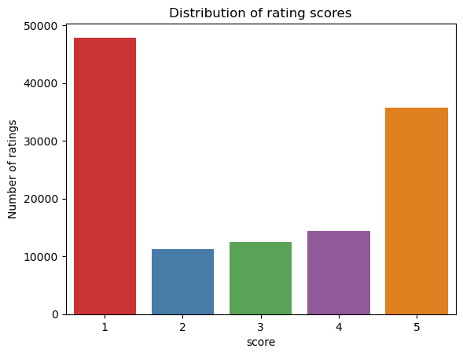
    
- The average rating score has gradually declined each year since 2018, with 2023 showing the lowest performance. However, there was a slight increase in the rating score in 2024.


- Display total number of people support others'review by per score
```python
sns.scatterplot(x='score', y='thumbsUpCount', data=netflix_df)
plt.ylabel('Number of thumbsUp on reviews')
plt.title("Number of people that support the other's reviews")
```
    
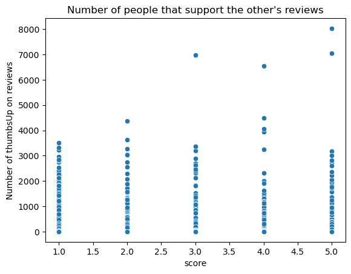
    


### **3.3. Time Series Analysis**

- Copy the dataframe and create new columns `month`, `year` for time series analysis.

```python
netflix_df_time_series = netflix_df.copy()  

netflix_df_time_series['month'] = netflix_df_time_series['at'].dt.month
netflix_df_time_series['year'] = netflix_df_time_series['at'].dt.year
```
- Plot the bar chart to explore the number of reviews each year

```python
sns.countplot(x=netflix_df_time_series['year'])
plt.title('Number of review from May 2018 to Dec 2024')
```

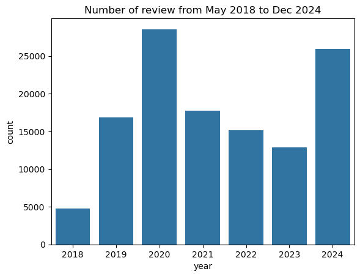
    
- Create a line chart to compare the review scores from 2018 to 2024
```python
for score in range(1, 6):
    plt.plot(score_counts.index, score_counts[score], label=f'Score {score}', marker='o')

plt.title('Review Counts by Score Over Time')
plt.xlabel('Year')
plt.ylabel('Number of Reviews')
plt.legend(title='Scores')
plt.grid(True)
plt.tight_layout()
plt.show()

```
    
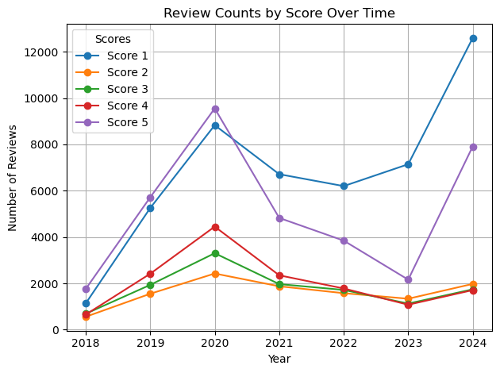
    

- Create a bar plot for thumbs-up counts for each score

```python
plt.bar(thumbsup_counts.index, thumbsup_counts.values)
plt.title('ThumbsUp Counts by Score')
plt.xlabel('Score')
plt.ylabel('Number of Thumbs Ups')
plt.tight_layout()
plt.show()
```
    
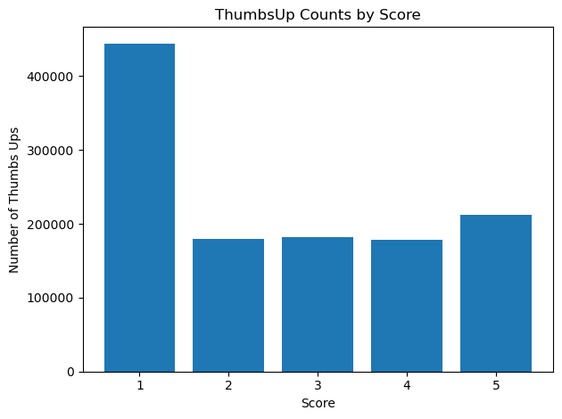
    

- Display the the max thumbsup vote content

```python

netflix_df_time_series[['content', 'score']][netflix_df_time_series['thumbsUpCount'] == 8032]
```

<div>
<style scoped>
    .dataframe tbody tr th:only-of-type {
        vertical-align: middle;
    }

    .dataframe tbody tr th {
        vertical-align: top;
    }

    .dataframe thead th {
        text-align: right;
    }
</style>
<table border="1" class="dataframe">
  <thead>
    <tr style="text-align: right;">
      <th></th>
      <th>content</th>
      <th>score</th>
    </tr>
  </thead>
  <tbody>
    <tr>
      <th>28076</th>
      <td>Wow! To be able to have Netflix on my phone is an absolute life-saver! Not only can I download my favourite TV shows and movies and be able to watch them any where at anytime (with or without Wi-Fi) theres also so much content to choose from (some a little too much content to choose from 😂). Really happy with it and looking forward to stranger things s4?</td>
      <td>5</td>
    </tr>
  </tbody>
</table>
</div>

- Display the top 5 reviews with 1 score recently with the most thumbsup from audiences


| Review Content                                                                                                                                                                                                                                                                                                | Review Date             | Thumbs Up Count |
|---------------------------------------------------------------------------------------------------------------------------------------------------------------------------------------------------------------------------------------------------------------|-------------------------|-----------------|
| The minute I switched the service to include ads, the service became shoddy. It WILL NOT play ads. This happens on two different devices. Netflix stops streaming when ads begin airing with some kind of buzzing just before it shuts down the device. I'm only playing it on one device at a time. Sometimes, it does this in the middle of the show being streamed. Get it fixed, dudes! This DOES NOT happen with other apps. So don't blame it on my devices. | 2023-07-18 01:15:07     | 3502            |
| Netflix has been pretty good for me for a long time. Last update just messed up the subtitle font shadows, so they are impossible to read against bright backgrounds. The only place to fix these are from their website - not possible to configure through the app. Very annoying, since I don't use browsers to view Netflix, since they don't support all features on all browsers. | 2022-07-28 09:24:58     | 3320            |
| The content is fine but the app is horrible and somehow keeps getting worse. Bad interface, loading issues in menus, videos freezing, etc. Now for some reason, when I login it takes me to the "New and Hot" tab instead of the "Home" tab. As though Netflix doesn't know what a home tab is. I've had Netflix for over a decade but I'm about done with it. Not just because they aren't fixing the existing issues, but because they seem to be actively trying to make it worse. Meanwhile prices keep rising. | 2023-06-29 05:40:01     | 3224            |
| For me, it's finally come time to move on from Netflix. Over the years, so much content has been pulled from the app (ie. Marvel/Disney) but Netflix hasn't really had much to show for it. However, they still have been introducing price increases. I understand that there will always be new streaming subscription services (Hulu, Disney+, Prime, etc) but would appreciate it if the value of a product would be tied directly to the content that is available vs. unavailable for its users. | 2023-06-22 04:46:21     | 2971            |
| I love Netflix but as of recently, it has been glitching like no other. To the point where you just either can't watch it or get too frustrated with it. I have heard this same thing happening to family and friends. It will let you start something then instantly stop 2 seconds in and go back to the home screen. I haven't even been able to watch a full episode of anything in like a month, this is getting really ridiculous. This needs to be fixed or you will lose a lot of people! | 2023-04-03 20:06:01     | 2857            |

---

### Explanation:
The table above displays user **reviews** along with the **thumbs up count** (a measure of positive feedback). This dataset provides insights into the **content quality** and **user satisfaction** based on real user feedback. The **review date** shows when the feedback was submitted, helping to track changes over time.

The **thumbs up count** could be used to gauge the relative popularity or approval of the reviews. Higher thumbs up counts typically indicate that the review resonates with more users, either due to its quality or the issues it raises.


# Plot the top 10 most frequent appVersion values
```python 
top_versions = version_counts.head(10)
top_versions.plot(kind='barh', figsize=(12, 6), title='Top 10 Most Frequent appVersions')
plt.xlabel('App Version')
plt.ylabel('Count')
plt.xticks(rotation=45) 
plt.tight_layout()
plt.show()

```
    
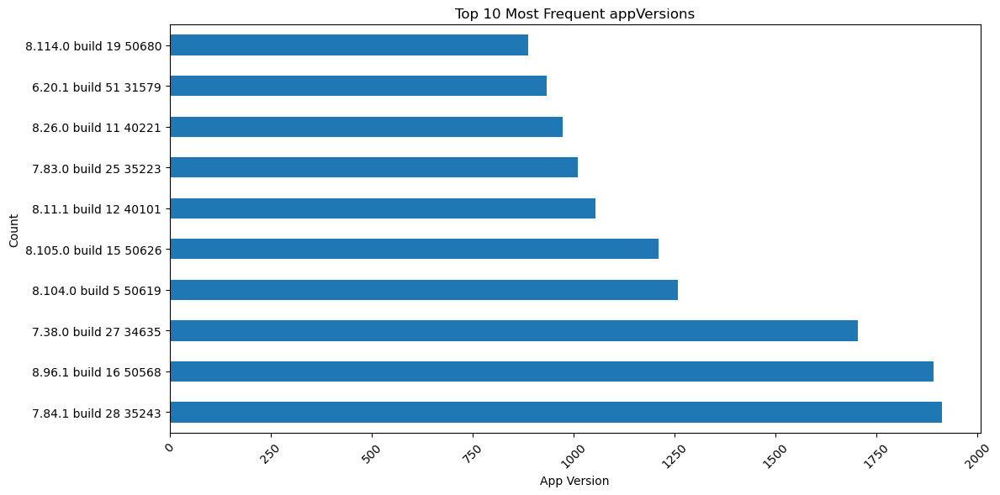
    

__Time Series Analysis for Year 2024__

-- Filter and copy the dataframe for year 2024

```python
netflix_df_2024 = netflix_df_time_series[netflix_df_time_series['year']== 2024]
```

- Create new column for content length
```python
netflix_df_2024['length'] = netflix_df_2024['content'].apply(len)
```
- Plot the histogram for the length distribution

```python
netflix_df_2024['length'].plot(bins=100, kind='hist', title="Disribution of the review's text length")
```
    
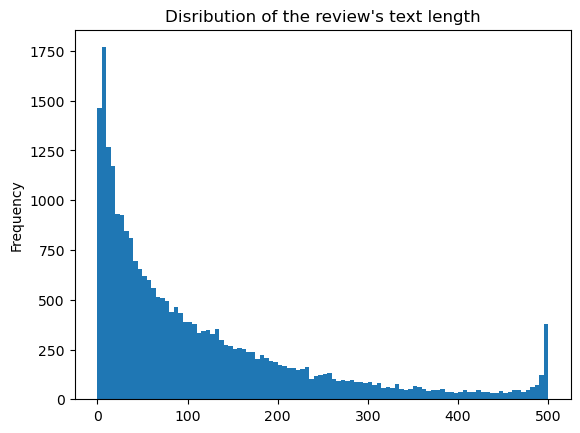
    
- Plot the number of reviews by score for 2024
```python
sns.countplot(x=netflix_df_2024['score'])
```
    
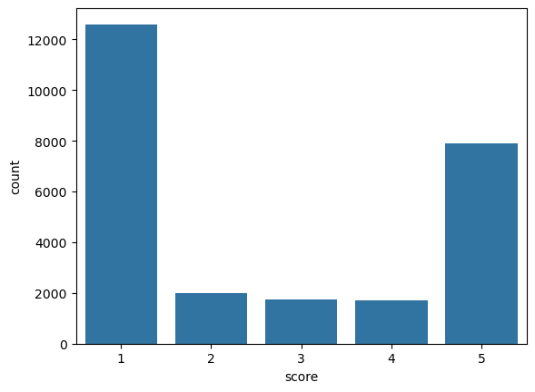
    
- Plot the number of reviews by score per month

```python
score_counts_2024 = netflix_df_2024.groupby(['month', 'score']).size().unstack(fill_value=0)
for score in range(1, 6):
    plt.plot(score_counts_2024.index, score_counts_2024[score], label=f'Score {score}', marker='o')

plt.title('Review Counts by Score Over Time')
plt.xlabel('Month')
plt.ylabel('Number of Reviews')
plt.legend(title='Scores')
plt.grid(True)
plt.tight_layout()
plt.show()

```
    
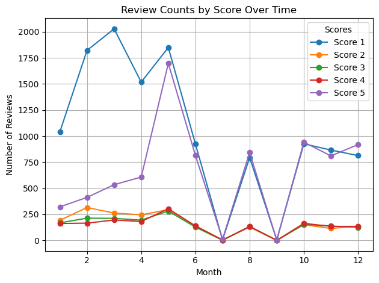
    
- Distribution of score ratings in 2024

```python
score_counts_2024 = netflix_df_2024['score'].value_counts()
plt.figure(figsize=(8, 6))
plt.pie(score_counts_2024, labels=score_counts_2024.index, autopct='%1.1f%%', startangle=90)

plt.title('Percentage of Each Review Score in 2024')
plt.tight_layout()
plt.show()
```


    
### **3.4. Sentiment Analysis**

- Exclude neutral reviews (score = 3) from the dataset and copy to the new dataframe for model training.

```python
netflix_df_model = netflix_df_2024[netflix_df_2024['score'] != 3]

def label_sentiment(scores):
    if scores in [1, 2]:
        return 0
    else:
        return 1
netflix_df_model['label'] = netflix_df_model['score'].apply(label_sentiment)
```
- Create 2 different dataset for positive and negative reviews

```python
positive = netflix_df_model[netflix_df_model['label'] == 1]
negative = netflix_df_model[netflix_df_model['label'] == 0]
```
- Define the pipeline to remove the stopwords and string for wordcloud and for training the Naive BAyes model.

```python
stop_words = set(stopwords.words('english'))
punctuation_set = set(string.punctuation)

def content_cleaning(message):
    message_without_punctuation = ''.join([char for char in message if char not in punctuation_set])
    cleaned_message = [
        word for word in message_without_punctuation.split()
        if word.lower() not in stop_words
    ] 
    return cleaned_message
```

- Apply the function to clean the positive and negative dataframe

```python
positive_cleaned = positive['content'].apply(content_cleaning)
negative_cleaned = negative['content'].apply(content_cleaning)
```

__Plot the WordCloud for the most common words in the reviews__

- Plot the positive reviews text

```python
plt.imshow(WordCloud().generate(positive_cleaned_toplot))
```
    
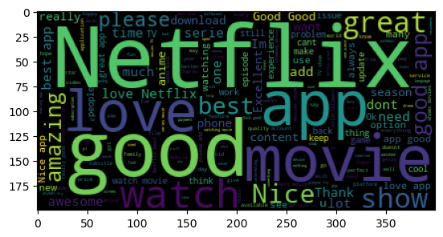
    
- Plot the negative reviews text

```python
plt.imshow(WordCloud().generate(negative_cleaned_toplot))
```
    
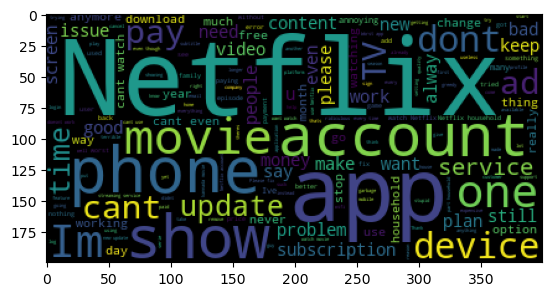
    

Apply vectorizer into the text reviews prior to train the models.
```python

vectorizer = CountVectorizer(analyzer=content_cleaning, dtype=np.uint8)
netflix_countvectorizer = vectorizer.fit_transform(netflix_df_model['content'])
```


```python
print(vectorizer.get_feature_names_out())
```

    ['0' '000' '00000' ... '🫴🫴' '🫶🏻🫶🏻🫰🏻🫰🏻' '🫶🏽🫶🏽🤌🏽']


```python
print(netflix_countvectorizer.toarray())  
```

    [[0 0 0 ... 0 0 0]
     [0 0 0 ... 0 0 0]
     [0 0 0 ... 0 0 0]
     ...
     [0 0 0 ... 0 0 0]
     [0 0 0 ... 0 0 0]
     [0 0 0 ... 0 0 0]]


```python
netflix_countvectorizer.shape
```


    (24195, 25167)

- Define independent and dependent variables (X,y)


```python
X = pd.DataFrame(netflix_countvectorizer.toarray())
```

```python
y = netflix_df_model['label']
```

## **4. Model Evaluation** 

### **4.1. Naive bayes Model Performance

- Split the dataframe into training and testing sets

```python
X_train, X_test, y_train, y_test = train_test_split(X,y,test_size=0.2)
```
- Train the Naive Bayes Model

```python
NB_classifier = MultinomialNB()
NB_classifier.fit(X_train, y_train)
```
- Display the confusion matrix to evaluate the effiency of the model

```python
y_predict_test = NB_classifier.predict(X_test)
cm = confusion_matrix(y_test, y_predict_test)
sns.heatmap(cm, annot=True)
```
```python
print(classification_report(y_test, y_predict_test))
```

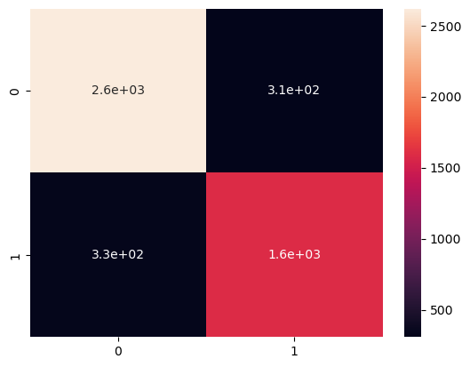
    


                  precision    recall  f1-score   support
    
               0       0.89      0.89      0.89      2927
               1       0.84      0.83      0.83      1912
    
        accuracy                           0.87      4839
       macro avg       0.86      0.86      0.86      4839
    weighted avg       0.87      0.87      0.87      4839
    


### **4.2. Logistic Regression Model Perfomance**


```python
model = LogisticRegression()
model.fit(X_train, y_train)

y_pred = model.predict(X_test)

cm = confusion_matrix(y_pred, y_test)
sns.heatmap(cm, annot = True)

print(classification_report(y_test, y_pred))
```
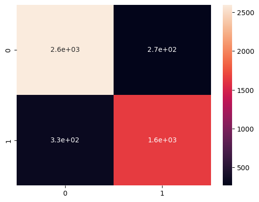  

                  precision    recall  f1-score   support
    
               0       0.91      0.89      0.90      2927
               1       0.83      0.86      0.85      1912
    
        accuracy                           0.88      4839
       macro avg       0.87      0.87      0.87      4839
    weighted avg       0.88      0.88      0.88      4839
    

### 5. Conclusion

- There is a slight improvement in the accuracy of the Logistic Regression model compared to the Naive Bayes model (0.88 vs. 0.87) for predicting whether a review is negative or positive in year 2024, especially as more text is added. The reviews were scored by users through rating stars, which is why the regression model was applied for this study and training purpose.


